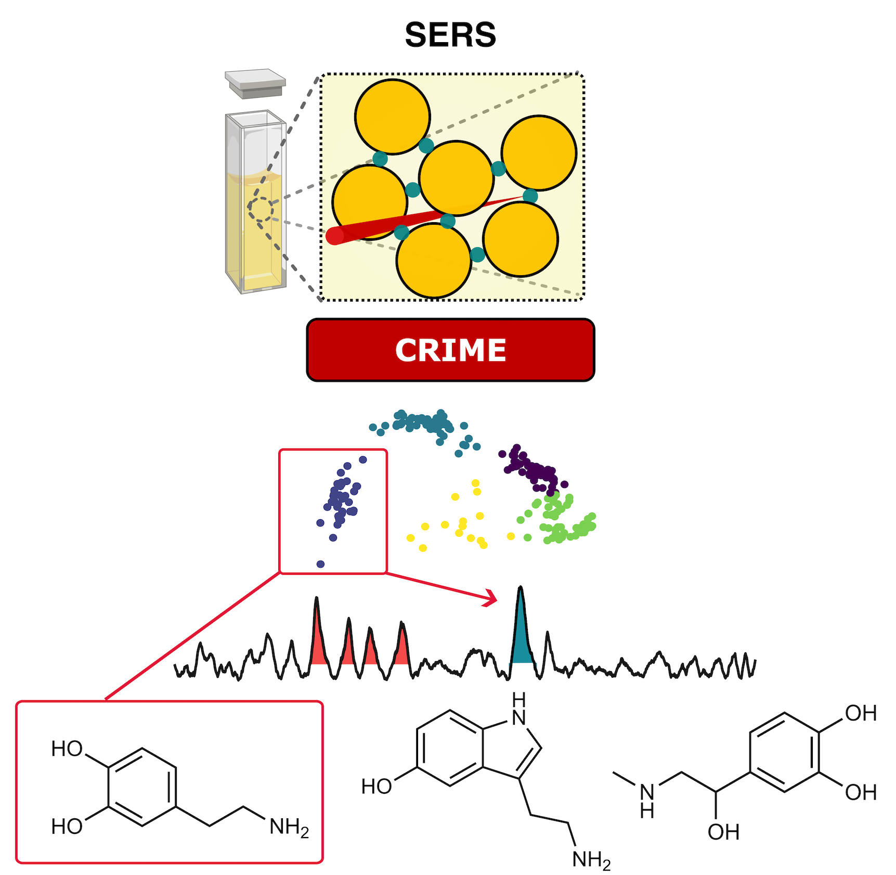
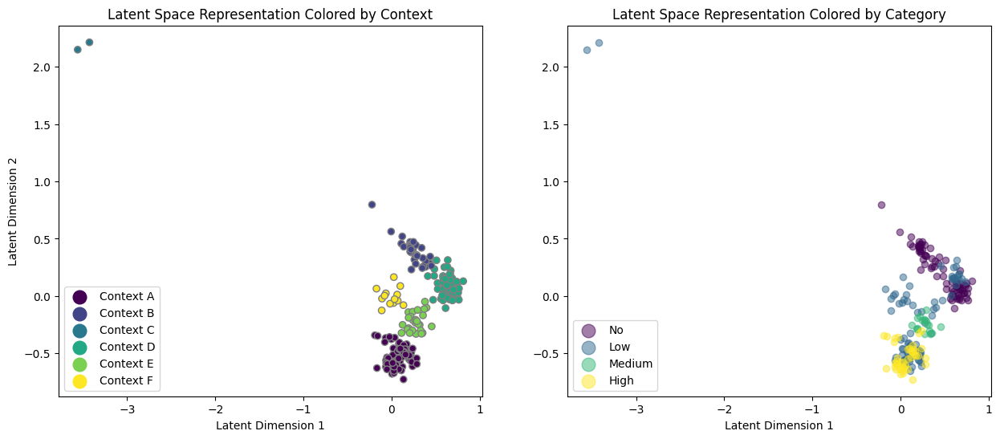
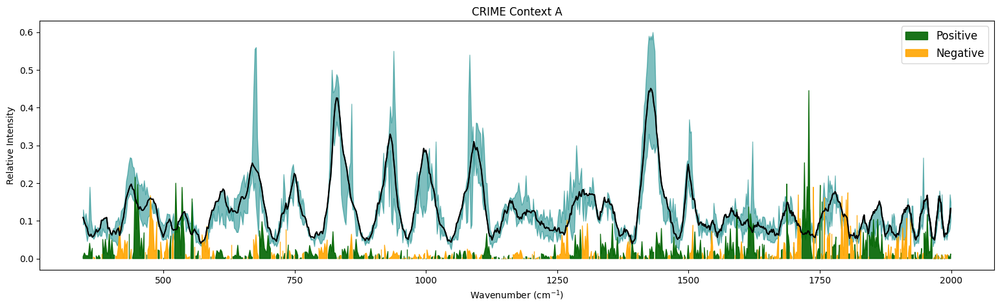
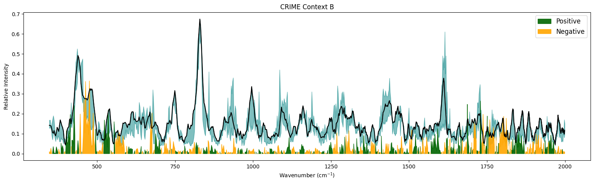
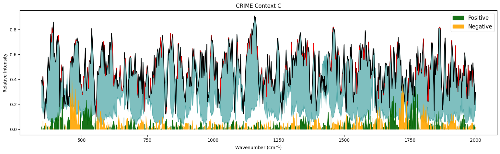
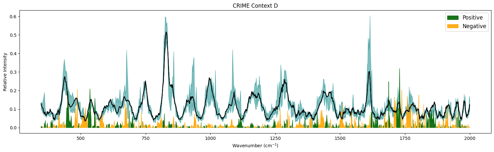
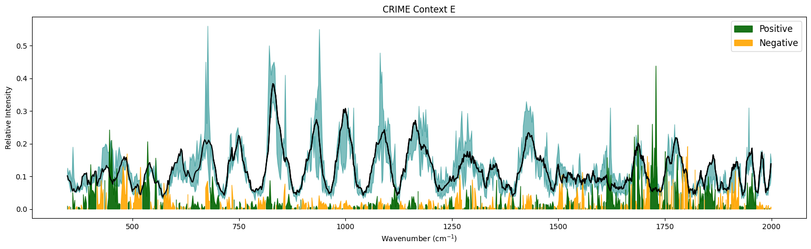
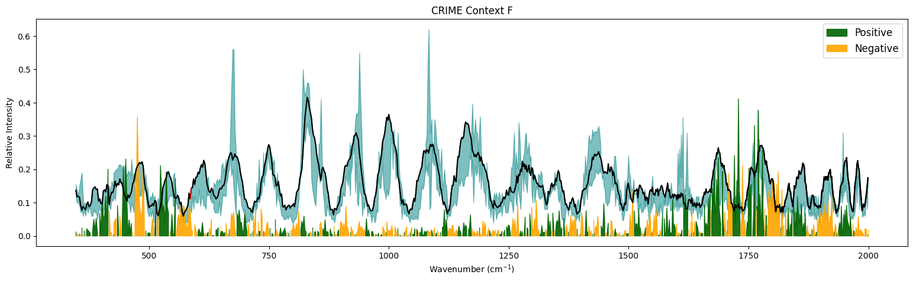

# Context Representative Interpretable Model Explanations (CRIME)


`CRIME` is a Python package that integrates with LIME (Local Interpretable Model-agnostic Explanations) to provide contextualized, interpretable predictions for spectral data analysis, particularly Surface Enhanced Raman Scattering (SERS) spectra. Developed at the intersection of chemoinformatics and machine learning, CRIME aims to enhance the interpretability of spectral data predictions by contextualizing them within discrete spectral segments. Lastly, CRIME enables the matching of compounds directly from CRIME contexts, providing a deeper understanding of model decisions, such as identifying if a model is misled by potential confounding analytes.

## Features

- **Interpretable Contexts:** Utilizes LIME to extract interpretable model explanations, which are then contextualized through the CRIME methodology.
- **Adaptability:** Initially designed for SERS spectra, but can be adapted for other spectral analyses.
- **Open-Source:** Available for modification and extension under the MIT License.

## Installation

Clone this repository and install the required packages:

```bash
git clone https://github.com/jkz22/CRIME.git
cd CRIME
```

## Structure

The package includes the following structure:
- `example_data_and_models/`: Sample datasets and pre-trained models.
- `CRIME/`: Core functionality including utilities and processing functions.
- `tests/`: Test scripts for validation of the package functionalities.

## Usage

### Data Preparation

Load your model and data. Ensure that all spectra use a consistent x-axis:

```python
import torch
import pandas as pd
import numpy as np
import CRIME.crime as cr
from CRIME.crime.CRIME_functions import run_CRIME
import CRIME.crime.lime_processing_functions as lpf
from sklearn.model_selection import train_test_split
from sklearn.linear_model import LinearRegression
from sklearn.preprocessing import MinMaxScaler
from tensorflow import keras
import tensorflow as tf

data = torch.load('CRIME/example data and models/data.pt')
labels = torch.load('CRIME/example data and models/labels.pt')
x_axis_values = pd.read_csv('CRIME/example data and models/xaxis.txt')[94:] # X-axis is cut to match the data.

'''
You can run our CNN model or a simplified linear regression model as an example.
The encoder is trained on explanations from the CNN model so the results may differ significantly.
For a full demo, it is reccommended you load your own prediction model, and train your own encoder using your own data.
'''

# Support function for CNN
@keras.saving.register_keras_serializable()
def mean_relative_percentage_error(y_true, y_pred):
    denominator = tf.where(tf.math.equal(y_true, 0), tf.ones_like(y_true), y_true)
    rpe = tf.abs((y_pred - y_true) / denominator)
    return 100 * tf.reduce_mean(rpe)

model = tf.keras.models.load_model(
    'CRIME/example data and models/linear_model.keras', custom_objects=None, compile=True, safe_mode=True
)

encoder = tf.keras.models.load_model(
    'CRIME/example data and models/VAE-CLIME-encoder.keras', custom_objects=None, compile=True, safe_mode=True
)

scaler = MinMaxScaler()
data_scaled = scaler.fit_transform(data)

# Train a simple linear regression model
# model = LinearRegression()
# Split data into training and test sets
# X_train, X_test, y_train, y_test = train_test_split(data, labels, test_size=0.2, random_state=42)
# model.fit(X_train, y_train)

# Define the prediction function for LIME
def model_predict(data):
    return model.predict(data)
```

### Running CRIME

Set up and run the CRIME analysis to obtain contexts and match them with target spectra:

```python

mode = 'regression'
# Initialize and run the explainer
explainer = lpf.spectra_explainer(data_scaled, len(x_axis_values))

# Categories in this instance refer to the ranges in the original data. These are primarily for the clustering plot.
categories = [data[labels == i].numpy() for i in range(4)]

# Similarly, each category label is necessary for the plot later.
category_names = ['No', 'Low', 'Medium', 'High']

# Calculate all LIME explanations for individual spectra.
lime_data, category_indicator, spectra_indicator, mean_spectra_list = lpf.calculate_lime(model, model_predict, categories, explainer, x_axis_values)

'''
The number of contexts is inferred from the length of the context names variable.
Therefore it is advised that the analysis is ran once with an arbitrary amount after which the number of contexts
is selected manually.
'''
context_names = list('ABCDEF')

# Execute CRIME analysis
separated_arrays, _, spectra_means, _, _, _, top_cluster_indices_global = run_CRIME(lime_data=lime_data, encoder=encoder, cat_names=category_names, context_names=context_names, mean_spectra_list = mean_spectra_list, category_indicator = category_indicator, plot_clusters=False)
```









### Compound matching

If target compounds exist, highlighted regions in CRIME contexts can be compared for identification of relevant compounds:

```python
sero = np.load('CRIME/example data and models/serotonin.npy')
dopa = np.load('CRIME/example data and models/dopamine.npy')
epi = np.load('CRIME/example data and models/epinephrine.npy')


# Ensure colors and targets are consistent in numbers
target_spectra = [sero, dopa, epi]
target_titles = ['Serotonin', 'Dopamine', 'Epinephrine']
target_colors = ['red', 'blue', 'green']

matched_targets, combined_similarities = cr.similarity_match(target_spectra, target_titles, target_colors, separated_arrays, top_cluster_indices_global, spectra_means)

```

## Contributing

Contributions to expand the applicability of CRIME to other spectral types or improvements in the interpretive algorithms are welcome. Please ensure to follow the coding standards and pull request guidelines detailed in the CONTRIBUTING.md.

## License

This project is licensed under the Apache 2.0 License - see the [LICENSE](LICENSE) file for details.

## Citation

If you use CRIME in your research, please cite it as follows:

```
Zaki, JK., Lio, P., Scherman, O. et al., (2024). Explainable Deep Learning Framework for SERS
Bio-quantification. arXiv.
```
