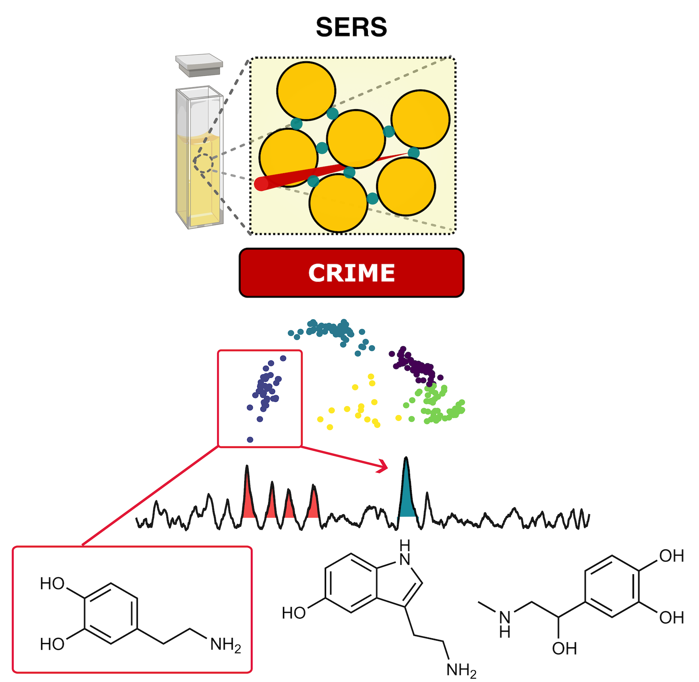

[]()
[]()

# Context Representative Interpretable Model Explanations (CRIME)


`CRIME` is a Python package that integrates with LIME (Local Interpretable Model-agnostic Explanations) to provide contextualized, interpretable predictions for spectral data analysis, particularly Surface Enhanced Raman Scattering (SERS) spectra. Developed at the intersection of chemoinformatics and machine learning, CRIME aims to enhance the interpretability of spectral data predictions by contextualizing them within discrete spectral segments. Lastly, CRIME enables the matching of compounds directly from CRIME contexts, providing a deeper understanding of model decisions, such as identifying if a model is misled by potential confounding analytes.

## Features

- **Interpretable Contexts:** Utilizes LIME to extract interpretable model explanations, which are then contextualized through the CRIME methodology.
- **Analyte similarity match:** Finds high-likelihood analyte-context pairings using cosine similarity and weighted spectra-LIME clusters.
- **Adaptability:** Initially designed for SERS spectra, but can be adapted for other spectral analyses.

## Quick Start
The fastest way to try CRIME is via the Colab demo:
[](https://colab.research.google.com/github/jkz22/CRIME/blob/main/CRIME_DEMO.ipynb)

The demo runs end-to-end on a subset of the data from the paper, demonstrating LIME explanations, VAE-based context discovery, and compound matching via cosine similarity. Note that the public demo uses a simplified model and training subset; full paper results were obtained on the complete dataset (see Methods in the paper).
  

## Installation

Clone this repository and install the required packages:

```bash
git clone https://github.com/jkz22/CRIME.git
cd CRIME
pip install -e .
```


  
## Usage

After training your prediction model and encoder, the core CRIME workflow is:

```python
import crime as cr
from crime.CRIME_functions import run_CRIME
import crime.lime_processing_functions as lpf

# Compute LIME explanations across categories
explainer = lpf.spectra_explainer(data_scaled, n_features, mode='regression')
lime_data, category_indicator, _, mean_spectra_list = lpf.calculate_lime(
    model, model_predict, categories, explainer, x_axis_values
)

# Discover prediction contexts via the encoder's latent space
separated_arrays, _, spectra_means, _, _, _, top_clusters = run_CRIME(
    lime_data=lime_data,
    encoder=encoder,
    cat_names=category_names,
    context_names=list('ABCDEF'),
    mean_spectra_list=mean_spectra_list,
    category_indicator=category_indicator,
)

# Match contexts to known compounds
matched, similarities = cr.similarity_match(
    target_spectra=[serotonin, dopamine, epinephrine],
    target_titles=['Serotonin', 'Dopamine', 'Epinephrine'],
    target_colors=['red', 'blue', 'green'],
    separated_arrays=separated_arrays,
    top_cluster_indices_global=top_clusters,
    spectra_means=spectra_means,
)
```

See `CRIME_DEMO.ipynb` for the full pipeline including model training, VAE encoder definition, and visualisation.


### Compound matching

If target compounds exist, highlighted regions in CRIME contexts can be compared for identification of relevant compounds:

```python
sero = np.load('examples/serotonin.npy')
dopa = np.load('examples/dopamine.npy')
epi = np.load('examples/epinephrine.npy')


# Ensure colors and targets are consistent in numbers
target_spectra = [sero, dopa, epi]
target_titles = ['Serotonin', 'Dopamine', 'Epinephrine']
target_colors = ['red', 'blue', 'green']

matched_targets, combined_similarities = cr.similarity_match(target_spectra, target_titles, target_colors, separated_arrays, top_cluster_indices_global, spectra_means)

```

## Structure

The package includes the following structure:
- `crime/` — core package: LIME processing, CRIME analysis, similarity matching
- `examples/` — sample data and pre-trained models for the demo
- `CRIME_DEMO.ipynb` — end-to-end demo notebook

## Contributing

Contributions to expand the applicability of CRIME to other spectral types or improvements in the interpretive algorithms are welcome. Please ensure to follow the coding standards and pull request guidelines detailed in the CONTRIBUTING.md.

## License

This project is licensed under the Apache 2.0 License - see the [LICENSE](LICENSE) file for details.

## Citation

If you use CRIME in your research, please cite it as follows:

```
Zaki, J. K., Tomasik, J., McCune, J. A., Bahn, S., Lió, P., & Scherman, O. A. (2025). Explainable deep learning framework for SERS bioquantification. ACS Sensors, 10(9), 6597–6606. https://doi.org/10.1021/acssensors.5c01058
```
